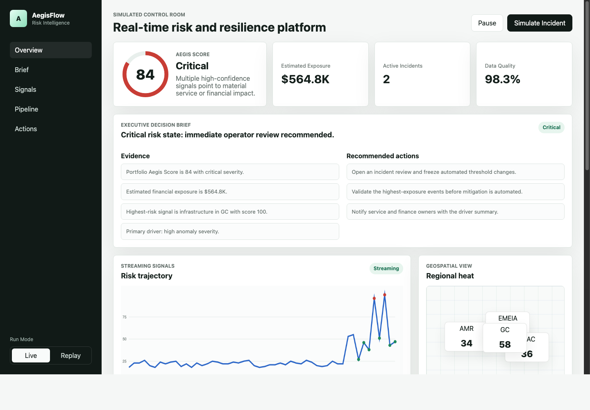
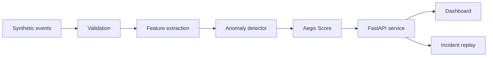

# AegisFlow

AegisFlow is a local simulation of a real-time risk intelligence platform. It streams synthetic business events, scores operational risk, explains the top drivers, estimates financial exposure, and recommends mitigation actions from a control-room style dashboard.



## Live Demo

Dashboard:

```text
https://ayush141910.github.io/aegisflow-risk-platform/
```

The hosted demo runs as a static dashboard. The full local mode adds the FastAPI backend, anomaly detector, validation checks, and incident replay API.

## Overview

The project connects six parts of a risk and resilience workflow:

- event generation
- data engineering reliability
- feature engineering and anomaly detection
- business impact forecasting
- backend API serving
- decision support for operations and finance

The runtime is intentionally lightweight so the demo can run without cloud infrastructure. The design still follows the same responsibilities a production system would need: ingest events, validate data quality, extract features, detect anomalies, score risk, explain the score, and trigger a response.

## Architecture



## Demo

Open the static dashboard:

```bash
python3 -m http.server 8000 --directory app
```

Then visit:

```text
http://localhost:8000
```

You can also open `app/index.html` directly in a browser.

The root `index.html` redirects to the dashboard so the project can also be served from GitHub Pages.

Run the full local pipeline:

```bash
pip install -r requirements.txt
uvicorn aegisflow.api:app --reload
```

Then visit:

```text
http://localhost:8000
```

API docs are available at:

```text
http://localhost:8000/docs
```

What to try:

- click `Simulate Incident`
- switch between `Live` and `Replay`
- pause and resume the stream
- click a region on the risk map
- watch the Aegis Score, pipeline health, driver summary, and mitigation queue change together

## Capabilities

- Replays transaction, login, infrastructure, finance, and external-event signals.
- Converts raw events into model-ready features.
- Scores anomalies against a learned local baseline.
- Calculates an Aegis Score from severity, model confidence, financial exposure, impacted services, region, and data quality.
- Surfaces explainability drivers instead of showing a mystery score.
- Estimates financial exposure so the alert has business context.
- Models pipeline health checks for schema quality, stream lag, and model freshness.
- Exposes events, scores, health checks, anomalies, and incident replay through FastAPI.
- Recommends mitigation actions such as replay validation, threshold locking, and traffic shifting.

## Example Incident

The dashboard includes a replay flow for an elevated regional incident. A login anomaly can increase the Aegis Score when severity, model confidence, impacted services, data quality drift, and estimated exposure move together.

See [docs/incident-walkthrough.md](docs/incident-walkthrough.md) for the full sequence.

## Repository Layout

```text
app/
  index.html        Interactive control-room dashboard
  styles.css        Responsive dashboard styling
  main.js           Streaming simulation and browser-side scoring
aegisflow/
  api.py            FastAPI service for full local mode
  anomaly_model.py  Local anomaly detector
  event_generator.py
  features.py       Feature extraction
  pipeline.py       Pipeline orchestration
  pipeline_health.py
  risk_engine.py    Aegis Score implementation
tests/
  test_risk_engine.py
docs/
  api.md
  architecture.md
  design-log.md
  incident-walkthrough.md
  limitations.md
data/
  sample_events.json
```

## Local Commands

Generate deterministic sample events:

```bash
python3 -m aegisflow.event_generator --count 240 --seed 7 --out data/events.json
```

Generate a shorter sample with an incident window:

```bash
python3 -m aegisflow.event_generator --count 32 --seed 17 --incident-start 12 --incident-end 18 --out data/sample_events.json
```

Inspect the committed sample event set:

```bash
python3 -m json.tool data/sample_events.json
```

Run tests:

```bash
python3 -m unittest discover -s tests
```

Start the dashboard:

```bash
python3 -m http.server 8000 --directory app
```

Start the full API-backed version:

```bash
uvicorn aegisflow.api:app --reload
```

Call the pipeline summary:

```bash
curl http://localhost:8000/api/summary
```

## Design Notes

The initial scoring model is intentionally transparent. In an operational dashboard, the model output needs to be explainable enough for an operator or business partner to understand why a signal changed and what action is recommended.

The dashboard can run in static mode with a browser-side event simulator, or in full local mode against the FastAPI pipeline. The Python package keeps scoring, validation, feature extraction, and anomaly detection separate from the UI.

In a production version, the local simulator would become:

- Kafka or Redpanda for event ingestion
- Spark Structured Streaming for feature windows and scoring
- Delta Lake or Iceberg for historical event storage
- Great Expectations for validation suites
- MLflow for experiment tracking and model registry
- Airflow for scheduled recovery, retraining, and backfill jobs
- a warehouse or serving store for dashboard queries

Additional notes:

- [docs/api.md](docs/api.md)
- [docs/design-log.md](docs/design-log.md)
- [docs/limitations.md](docs/limitations.md)
