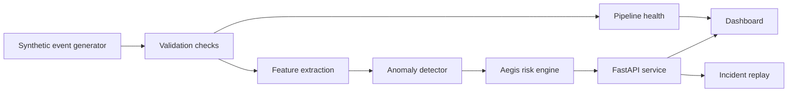

# AegisFlow Architecture

## System Shape



## Event Families

AegisFlow models five event families because they map to different business questions:

- `transaction`: payment and purchase behavior
- `login`: account access and identity risk
- `infrastructure`: service latency, error spikes, and platform health
- `finance`: close, accrual, and forecasting workflows
- `external`: regional events that may change demand or service risk

## Aegis Score

The score is a 0-100 risk score. It is not meant to be a universal truth. It is a triage number that helps an operator decide what to inspect first.

Inputs:

- anomaly severity
- model confidence
- estimated financial exposure
- number of impacted services
- region weighting
- data quality penalty

The current formula is intentionally transparent so it can be explained in an interview. A production system could replace pieces of it with learned weights, calibrated probabilities, or a rules-plus-model hybrid.

## Local Pipeline

The local pipeline is split into modules:

- `event_generator.py`: creates deterministic event streams and incident windows
- `pipeline_health.py`: validates batch quality and recommends recovery actions
- `features.py`: converts raw events into model-ready numerical features
- `anomaly_model.py`: scores events against a learned local baseline
- `risk_engine.py`: calculates the Aegis Score and explanation drivers
- `pipeline.py`: orchestrates validation, anomaly detection, and scoring
- `api.py`: exposes the pipeline through FastAPI endpoints

This keeps the dashboard separate from the data and scoring logic. The browser can run in static demo mode, while the full local mode runs through the API.

## Self-Healing Boundaries

The platform recommends recovery actions, but it does not silently erase failures. That boundary matters. If data quality drops, the system should quarantine or replay data and make the degraded state visible. It should not hide uncertainty behind a clean-looking dashboard.

Current simulated actions:

- replay the last healthy batch
- hold threshold updates during quality drift
- route a source to quarantine
- increase sampling during elevated risk
- notify the owning team with driver context

## Production Extension

The lightweight demo can evolve into a larger data platform without changing the product story:

```text
browser simulator  ->  Kafka / Redpanda producers
local pipeline      ->  Spark Structured Streaming job
JSON event history  ->  Delta Lake / Iceberg table
inline checks       ->  Great Expectations suites
manual simulation   ->  Airflow recovery DAGs
dashboard state     ->  warehouse-backed API
```

The important part is the contract between stages: every event should have enough context to explain why it was scored, what it may cost, and what action is recommended.
